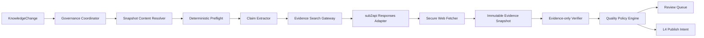

# L3 Claim、联网证据与质量治理设计

> 日期：2026-07-28
> 状态：已确认，待实施计划
> 基线：L0 模型网关、L1 SQLite 控制面、L2 本地 Markdown 采集与恢复
> 范围：Claim 抽取、sub2api 联网搜索、证据快照、Evidence-only Verifier、确定性质量门、人工复核与恢复

## 1. 决策摘要

L3 采用逐 Claim 分阶段流水线。L2 产生的 `KnowledgeChange(RECEIVED)` 是唯一入口；L3 不重新扫描 Vault，也不直接修改 Obsidian。每个 Claim 独立完成抽取、搜索、抓取、证据打包、验证和质量裁决，业务账本负责幂等与恢复，LangGraph 只负责固定编排。

首个联网检索实现使用配置好的 sub2api OpenAI-compatible `/v1/responses` 与原生 `web_search` 工具。模型搜索只负责发现候选 URL；模型生成的摘要、snippet、URL 或自述来源等级都不能直接成为 Evidence。候选页面必须经过网络策略验证、独立抓取、不可变快照、结构解析和安全扫描，才能进入 Evidence Pack。

Verifier 只接收结构化 Claim 和已快照证据，不具备搜索或工具能力。最终 `VERIFIED`、`CONTESTED`、`INSUFFICIENT`、`REJECTED`、`QUARANTINED` 等裁决由版本化确定性策略计算，模型不能直接修改状态。

默认允许 T0 个人陈述和证据充分的低风险事实自动进入可发布状态。医疗、法律、财务和安全类 Claim 必须人工批准；人工批准是使用决策，不是真实性证明。搜索能力不可用、引用不可抓取或证据无法校验时失败关闭，不自动切换其他搜索服务，也不使用模型训练记忆补足事实。

## 2. 目标与非目标

### 2.1 目标

- 从 READY SourceVersion 的不可变快照中抽取带原文锚点的最小 Claim。
- 区分事实、定义、过程、代码行为、用户经历、偏好、决定、观点和预测。
- 保留否定、模态、条件、例外、版本、时间、地域、项目和 owner scope。
- 对公共事实执行支持检索与反证检索。
- 将网页证据保存为不可变 SourceVersion，并绑定锚点和 excerpt hash。
- 防止转载、衍生摘要和 AI 内容被误算成独立来源。
- 使用 Evidence-only Verifier 生成逐证据结构化判断。
- 使用确定性质量策略决定 Claim 状态和 L4 发布资格。
- 将高风险、冲突、证据不足和安全问题送入持久化人工复核队列。
- 在模型、网络、进程或 SQLite 故障后恢复，不产生重复 Claim、Evidence、QualityCheck 或审计记录。
- 保持 LLM 和搜索提供方抽象，业务代码不依赖 sub2api 具体协议。

### 2.2 非目标

- 不实现 Milvus、Embedding、BM25、RRF 或 Reranker。
- 不生成或写回 Obsidian 整理稿。
- 不实现 L4 两阶段发布、索引激活或 Reconciler。
- 不实现 L5 API、问答、引用验证或 RAGAS。
- 不支持 PDF、OCR、图片、附件、JavaScript 渲染、登录态或付费墙抓取。
- 不开发人工复核 Web UI。
- 不实现定时调度、文件监听或多 worker 并行消费。
- 不实现 Brave、Bing 或其他搜索 Adapter；只冻结其公共扩展点。
- 不递归抽取证据网页中的 Claim；网页 SourceVersion 仅用于 Evidence。
- 不清理无引用的内容寻址快照；无引用快照在本层是安全可回收对象。

## 3. 已有基线与不可变约束

L3 复用以下能力：

- L0 `ModelGateway`、`ModelRouter`、按 purpose 的模型覆盖、结构化输出校验和安全错误映射。
- L1 类型化 ULID、冻结领域记录、显式状态机、Repository、Unit of Work、ModelRun、OperationLog、幂等租约和 Alembic-only schema 管理。
- L1 `Claim`、`ClaimOrigin`、`EvidenceFamily`、`Evidence`、`QualityCheck` 及其 Repository。
- L2 READY SourceVersion、ContentBlock 哈希与锚点、内容寻址原文快照、KnowledgeChange、确定性安全信号和 LangGraph 恢复模式。

以下约束不可放宽：

1. Markdown 和网页正文不进入业务 SQLite、checkpoint、OperationLog、错误或普通日志。
2. 业务账本是恢复真源；checkpoint 只保存 ID、阶段、哈希和计数。
3. Repository 不隐式提交，所有状态写入必须位于显式 Unit of Work。
4. 模型和网络调用不能持有 SQLite 写事务。
5. 新版本裁决完成前不能淘汰旧 Claim。
6. 没有证据不等于错误，只能得到 `INSUFFICIENT`。
7. 人工决定不能把 `CONTESTED` 或 `INSUFFICIENT` 改写成 `VERIFIED`。
8. 默认 CI 不联网、不读取真实 Vault、不使用真实 key 或私人数据。

## 4. 总体架构



### 4.1 `GovernanceCoordinator`

- 选择 `RECEIVED` KnowledgeChange。
- 创建或恢复同一 change/policy 的 GovernanceRun。
- 将 KnowledgeChange CAS 转换为 `VALIDATING`。
- 调用抽取阶段并为每条 Claim 创建 GovernanceItem。
- 顺序或受限并发推进 Claim item。
- 对账所有 item、受影响旧 Claim 和 review request。
- 只在全部技术步骤确定结束后设置最终 KnowledgeChange 状态。

### 4.2 `SnapshotContentResolver`

- 根据 target SourceVersion 的 content hash 定位 L2 快照。
- 读取原始字节并复算 SHA-256。
- 使用与 L2 相同版本的解析器恢复结构块文本。
- 对照 SQLite 中的 anchor、ordinal、text hash 和字符数。
- 只向下游提供当前进程内存中的规范化块文本。

快照缺失、哈希不符或结构块不一致是技术完整性失败，不能退化为模型推测。

### 4.3 `DeterministicPreflight`

- 检查 SourceVersion 状态、L2 safety signals、来源 sensitivity 和 completeness。
- 决定是否允许联网搜索。
- 标记高风险领域和强制人工复核条件。
- 在确定性阻断时避免不必要的模型调用。

### 4.4 `ClaimExtractor`

- 通过 `ModelGateway.invoke_structured()` 和 `ModelPurpose.CLAIM_EXTRACTION` 调用模型。
- Prompt 只包含被明确标记为数据的块文本，不允许工具调用。
- 输出最小 Claim、结构化 scope、origin span 和风险提示。
- 程序重新验证 origin span、Claim 数量、字段长度和枚举。
- ModelRun 记录 provider、model、prompt version、输入/输出哈希、token 和状态，不保存正文。

### 4.5 `EvidenceSearchGateway`

- 暴露提供方无关的 `capabilities()` 和 `search()` 契约。
- 初始 Adapter 使用 sub2api Responses API Web Search。
- 搜索结果只是候选发现结果，不是 Evidence。
- 不支持能力、引用缺失或响应无法验证时抛出安全错误并失败关闭。

### 4.6 `SecureWebFetcher`

- 对候选 URL 执行规范化、DNS、SSRF、重定向、TLS、robots、MIME、大小和时间策略。
- 不使用系统代理环境、Cookie、JavaScript 或子资源。
- 将原始响应字节和规范化文本写入内容寻址存储。
- 通过窄用途 Evidence Source 服务创建 Source、SourceVersion 和 ContentBlock。
- Evidence 网页不创建 KnowledgeChange，避免递归 Claim 抽取。

### 4.7 `EvidenceVerifier`

- 通过 `ModelPurpose.EVIDENCE_VERIFICATION` 使用独立 Prompt 和上下文。
- 只读取 Claim 与 Evidence Pack，不允许搜索、工具或自由补充来源。
- 为每个候选返回 stance、覆盖范围、版本/时间/scope 匹配和原因代码。
- 不返回最终 Claim 状态。

### 4.8 `QualityPolicyEngine`

- 将确定性信号和 Verifier assessment 组合成版本化 QualityDimensions。
- 按固定矩阵生成 QualityVerdict、ClaimStatus 和 ReviewRequirement。
- 所有阈值和 reason code 绑定 `policy_version`。

### 4.9 `ReviewService`

- 列出待复核记录。
- 显示本地结构化 Claim、维度和引用标识。
- 通过 CAS 记录批准或拒绝。
- 追加不可变审计，不修改历史 QualityCheck。

## 5. 配置与提供方抽象

新增 `TRUSTKB_GOVERNANCE_*`、`TRUSTKB_SEARCH_*` 和 `TRUSTKB_FETCH_*` 配置。所有路径、key 和内部 endpoint 使用 SecretStr 或边界属性揭示。

关键配置：

- governance policy、extractor prompt、verifier prompt 和 search policy 版本；
- 最大 Claim 数、单次运行并发和重试上限；
- search provider、model、Responses transport 和超时；
- 搜索次数、候选 URL 数和 Evidence Pack 预算；
- fetch timeout、最大原始/解压字节、重定向数和 MIME allowlist；
- evidence snapshot root 和 governance checkpoint path；
- 官方域名来源等级映射；
- opt-in live integration 标志。

默认：

- search provider 为 `sub2api`；
- search model 继承 `TRUSTKB_LLM_MODEL`，但允许独立覆盖；
- base URL 和 API key 复用统一 LLM 配置边界，不复制到业务对象；
- checkpoint 为 `./storage/checkpoints/governance.sqlite`；
- evidence snapshot 为 `./storage/evidence-snapshots`；
- 每文档最多 100 条 Claim；
- 每 Claim 最多 4 次搜索、8 个来源和 16 个证据块。

`EvidenceSearchGateway` 与 `ModelGateway` 是相邻但不同的抽象：前者负责候选 URL 发现和 citation 契约，后者负责 Claim 抽取与证据验证。业务服务只依赖 Protocol，不直接创建 OpenAI、sub2api 或 LangChain 客户端。

## 6. 结构化领域契约

### 6.1 Claim Draft

`ClaimDraft` 至少包含：

- `claim_type`；
- `subject`、`predicate`；
- `object`：value、value type、normalized value、unit/currency、原始术语；
- `scope`：owner、domain、project、geography、version、conditions、exceptions、polarity、modality 和 lifecycle status；
- `valid_from`、`valid_to`、`freshness_at`；
- `sensitivity`；
- 一个或多个 block anchor 与块内字符 span；
- 模型风险提示，但不包含最终 risk level 或 verdict。

`object_json` 和 `scope_json` 继续使用现有 JSON 列，但只能由严格 Pydantic 子模型生成。新增 `ClaimType.OPINION`，避免把普通主观判断错误归入 `PREDICTION`。

### 6.2 Claim 身份

`claim_fingerprint`：

```text
SHA256(canonical_json(
  claim_type, subject, predicate, object, scope,
  valid_from, valid_to, freshness_at, sensitivity
))
```

`claim_family_key`：

```text
SHA256(canonical_json(
  claim_type, subject, predicate,
  scope excluding transient validity fields
))
```

完全相同 fingerprint 的 active Claim 被复用并追加 origin。相同 family key、不同 object/value 的 Claim 是同一事实族的新候选；旧 Claim 只在新 Claim 完成裁决后进入 `OUTDATED` 或 `SUPERSEDED`。

### 6.3 Search 契约

`SearchCapabilities`：

- supports Responses API；
- supports native web search；
- supports URL citations；
- returns provider request ID；
- supported model 与限制。

`EvidenceSearchRequest`：

- PUBLIC 结构化 Claim；
- intent：SUPPORT 或 CHALLENGE；
- time/version/scope constraints；
- max results；
- policy version 与 idempotency hash。

`EvidenceSearchHit`：

- 临时 candidate ID；
- HTTPS URL；
- title 与 provider citation metadata；
- provider request ID；
- rank；
- 不可信 snippet，仅允许进入本地 search manifest。

### 6.4 Fetch 契约

`FetchedEvidenceDocument`：

- normalized/final URL；
- raw content hash；
- normalized text hash；
- media type、byte size、captured time；
- HTTP freshness metadata 的哈希化安全子集；
- completeness 和 extraction status；
- snapshot refs；
- parsed evidence blocks；
- safety signals。

### 6.5 Evidence Pack

Evidence Pack 是冻结、内容寻址 JSON：

- Claim fingerprint 和结构化 Claim；
- search policy、query hash 和 search result snapshot hash；
- 有序候选 ID；
- source_version_id、anchor、excerpt hash；
- 来源等级、日期、版本和 completeness；
- evidence family；
- search intent；
- pack budget 和截断原因；
- pack hash。

SQLite 只保存 pack hash。Verifier 运行时根据 hash 加载 pack 和对应本地快照正文。

### 6.6 Verifier 输出

每个候选必须返回：

- candidate ID；
- `SUPPORTS`、`CONTRADICTS` 或 `NEUTRAL`；
- supported claim fields；
- evidence coverage；
- scope、version 和 freshness match；
- relevance；
- reason codes。

程序拒绝不存在的 candidate ID、重复引用、数值越界、无引用结论和自由 URL。

## 7. SQLite 模型与迁移

### 7.1 Claim 扩展

`claims` 新增：

- `claim_fingerprint CHAR(64) NOT NULL`；
- `claim_family_key CHAR(64) NOT NULL`。

两列使用 SHA-256 CheckConstraint 和索引。active 精确 Claim 使用 partial unique index 防止并发重复；历史 superseded/deleted 记录允许保留。

迁移对既有 Claim 先按冻结的 canonical JSON 规则回填两列，再检查 active fingerprint 冲突。发现冲突时迁移安全失败并要求显式数据修复，禁止自动删除、合并或任意选择一条记录；校验通过后才建立 NOT NULL 和 partial unique 约束。

### 7.2 `governance_runs`

关键字段：

- `id`：`govrun_` Typed ULID；
- `knowledge_change_id`；
- `target_source_version_id`；
- `policy_version`；
- extractor/verifier/search prompt 或 policy version；
- `status`；
- total、decided、review、failed、quarantined 计数；
- safe `error_category`；
- revision、started/completed/created/updated timestamps。

唯一键为 `(knowledge_change_id, policy_version)`。同一 change/policy 只能存在一个逻辑运行。L3 不自动重开已经终态的 KnowledgeChange；未来 policy 升级重验必须由显式 maintenance change 触发，不能只靠更换 policy version 绕过 KnowledgeChange 状态机。

### 7.3 `governance_items`

关键字段：

- `id`：`govitem_` Typed ULID；
- `run_id`、`claim_id`；
- `stage`、`attempt`；
- `risk_level`；
- search result manifest hash；
- evidence pack hash；
- current quality check ID；
- safe error category；
- revision 和 timestamps。

唯一键 `(run_id, claim_id)`。Item 不保存查询、URL、正文、excerpt 或模型输出。

### 7.4 `review_requests`

关键字段：

- `id`：`reviewreq_` Typed ULID；
- `claim_id`、`quality_check_id`、`knowledge_change_id`；
- risk/reason code；
- `PENDING/APPROVED/REJECTED/CANCELLED`；
- decision reason code、actor type 和 decided time；
- revision 和 timestamps。

同一 quality check 只允许一个 live review request。决定只追加审计，不修改历史 QualityCheck。

### 7.5 枚举变化

- `ClaimType` 新增 `OPINION`。
- `ClaimStatus` 新增 `QUARANTINED`。
- `KnowledgeChangeStatus` 新增 `REVIEW_REQUIRED`。
- `ModelRunPurpose` 新增 `EVIDENCE_SEARCH`，sub2api 搜索调用必须创建对应 ModelRun。
- 新增 GovernanceRunStatus、GovernanceItemStage、ReviewRequestStatus 和 RiskLevel。

SQLite Enum CheckConstraint 通过 Alembic batch migration 显式更新。迁移必须支持 online、offline SQL、downgrade 和 ORM metadata 一致性测试。

### 7.6 状态转换

```text
GovernanceRun:
PLANNING → EXTRACTING → EVALUATING → RECONCILING
         → COMPLETED | PARTIAL_FAILED | FAILED | QUARANTINED

GovernanceItem:
EXTRACTED → EVIDENCE_PENDING → VERIFYING → DECIDING
          → DECIDED | REVIEW_REQUIRED | FAILED

ReviewRequest:
PENDING → APPROVED | REJECTED | CANCELLED
```

T0/OPINION item 可以从 EXTRACTED 直接进入 DECIDING。只有已经完成确定性安全检查的 item 才能进入 EVIDENCE_PENDING。任何终态不可反向打开；重新处理必须增加 attempt 或在新 policy version 下创建新 GovernanceRun。

Claim 转换扩展为：

- PROPOSED 可以进入 VERIFIED、USER_ASSERTED、OPINION、INSUFFICIENT、CONTESTED、REJECTED 或 QUARANTINED；
- VERIFIED、USER_ASSERTED、OPINION、INSUFFICIENT、CONTESTED 可以进入 OUTDATED 或 SUPERSEDED；
- REJECTED 和 QUARANTINED 是真实性历史终态，只能保留或逻辑删除，不能由重试升级；
- DELETED change 只将仍可能被使用的 active Claim 标为 OUTDATED，历史 REJECTED/QUARANTINED 保持原裁决。

KnowledgeChange 转换扩展为：

- RECEIVED → VALIDATING；
- VALIDATING → PUBLISH_INTENT、REVIEW_REQUIRED、FAILED 或 QUARANTINED；
- REVIEW_REQUIRED → PUBLISH_INTENT、FAILED 或 QUARANTINED；
- PUBLISH_INTENT 后续仍由 L4 转为 ACTIVE 或 FAILED。

## 8. 内容寻址证据存储

建议布局：

```text
storage/evidence-snapshots/
  search/sha256/ab/<hash>.json
  raw/sha256/ab/<hash>.bin
  extracted/sha256/ab/<hash>.json
  packs/sha256/ab/<hash>.json
```

所有写入使用同目录临时文件、flush、文件 fsync 和原子 rename；目录 fsync 在平台支持时执行。目标已存在时复算 hash 并复用。文件名不包含 URL、域名、Claim 文本或私人标识。

Search manifest 可以包含 PUBLIC 查询和不可信 snippet，用于本地审计，但不得进入 Git、日志或业务数据库。快照 root 必须与 Vault 分离并被 `.gitignore` 覆盖。

## 9. 端到端数据流

### 9.1 CREATED / UPDATED

1. 选择 RECEIVED KnowledgeChange 并创建 GovernanceRun。
2. CAS 将 change 转为 VALIDATING。
3. 加载 target SourceVersion 快照并复核块哈希。
4. 运行 deterministic preflight。
5. 在事务外调用 Claim Extractor。
6. 原子保存 Claim、origin、fingerprint 复用结果和 GovernanceItem。
7. 按 Claim 类型、sensitivity 和 risk 决定是否联网。
8. 对公共事实分别执行 SUPPORT 与 CHALLENGE 搜索。
9. 校验并抓取候选 URL，形成 Evidence SourceVersion。
10. 构建冻结 Evidence Pack。
11. 在事务外执行 Evidence-only Verifier。
12. QualityPolicyEngine 计算 verdict 和 review requirement。
13. 单事务保存 Evidence、QualityCheck、Claim 转换、review request、item 和审计。
14. 全部 item 终态后处理旧 Claim impact。
15. reconcile KnowledgeChange 为 PUBLISH_INTENT、REVIEW_REQUIRED、FAILED 或 QUARANTINED。

### 9.2 MOVED

MOVED 不改变内容：

- 不重新抽取、不联网、不调用 Verifier；
- 复用当前 Claim 和 QualityCheck；
- 创建一个确定性完成的 GovernanceRun；
- KnowledgeChange 进入 PUBLISH_INTENT，交给 L4 更新可读链接或元数据。

### 9.3 DELETED

- 不执行抽取和搜索。
- 查找只由被删除来源支撑的 active Claim。
- 有其他 live origin 的 Claim 保持原状态。
- 无其他 live origin 的 Claim 转为 OUTDATED。
- KnowledgeChange 进入 PUBLISH_INTENT，要求 L4 失效整理稿和索引。

### 9.4 版本更新与旧 Claim

新版本验证期间旧 Claim 保持原状态。新版本完成后：

- 相同 fingerprint：复用并追加 origin；
- 相同 family key、值变化：新 Claim 成功裁决后旧 Claim SUPERSEDED；
- 旧 Claim origin 所在块被删除或修改、且没有新 origin：OUTDATED；
- 新版本技术失败：不改变旧 Claim，KnowledgeChange FAILED；
- 新版本被隔离：不改变旧 Claim，KnowledgeChange QUARANTINED。

L4 将依据 change 状态让旧 curated version 保持可见但显示 stale，直到新发布完成。

## 10. sub2api Responses Web Search

初始 Adapter 明确调用配置 base URL 下的 `/v1/responses`，使用 `web_search` 工具和独立 search model。它不复用普通 Chat Completions 的返回解析，也不自动尝试未知协议。

启动或首次调用时执行能力探测：

1. Responses endpoint 可用；
2. 当前 model 接受 web_search；
3. 返回 URL citation；
4. 返回 provider request ID；
5. citation 可被严格 Schema 解析。

探测结果只缓存非秘密 capability metadata。能力明确不受支持时抛出 `SearchCapabilityUnavailableError`，创建空 evidence snapshot 的 QualityCheck，业务结果为 `INSUFFICIENT/REVIEW_REQUIRED`，不回退到模型记忆或其他搜索服务。已经声明支持但发生超时、限流、上游 5xx 或响应损坏属于技术失败，不能伪装成 INSUFFICIENT。

每个请求使用有限输出、明确 max tool calls、超时和取消。Provider 原始错误与响应正文不向上暴露。每次搜索创建 `ModelRunPurpose.EVIDENCE_SEARCH` 记录，保存 token、查询数、provider、model、request hash 和 provider request ID 的安全哈希，不保存搜索词或响应正文。

## 11. 搜索隐私策略

允许联网的必要条件：

- Claim sensitivity 为 PUBLIC；
- 不属于 T0 用户经历、偏好或决定；
- query builder 能只使用公共结构化字段；
- 不包含 Secret、高熵 token、私人 URL、文件路径、用户名或 owner ID；
- 不包含未获授权的组织内部标识。

`PRIVATE/RESTRICTED` Claim 不联网。若可安全拆出公共子 Claim，必须创建新的公共 Claim 并保留 lineage；不得在查询字符串中做临时替换后继续验证原私人 Claim。

查询由确定性 builder 生成，并区分 SUPPORT/CHALLENGE。模型不能自由扩展私人上下文。搜索日志只保存 query hash。

## 12. 安全网页抓取

### 12.1 URL 策略

- 仅允许 HTTPS。
- 禁止 username/password、fragment、非标准端口和本地文件 scheme。
- 去除已知 tracking 参数；包含 token、signature、key、session 等敏感参数的 URL 拒绝抓取。
- host 采用 IDNA 规范化并检查 Unicode 混淆。
- 默认不允许裸 IP URL。

### 12.2 SSRF 与重定向

- 每次请求前解析所有 A/AAAA 地址并拒绝 loopback、private、link-local、multicast、reserved、unspecified 和 cloud metadata 范围。
- HTTP transport 禁用 `trust_env`，避免继承代理和凭据。
- 连接后检查实际 peer IP 仍属于已批准公网集合，防止 DNS rebinding。
- 每次重定向重新执行完整 URL/DNS/peer 策略。
- 最多 3 次重定向；不自动从 HTTPS 降级。

### 12.3 响应策略

- TLS 证书验证始终开启。
- 限制连接、首字节、总读取时间和每域并发。
- 流式读取并限制压缩前后字节及解压比例。
- 只接受 text/html、text/plain 和 text/markdown。
- PDF、二进制、登录页、验证码、付费墙和不完整正文标记为不可用。
- 不执行 JavaScript，不加载图片、CSS、iframe 或其他子资源。
- 不保存 Cookie，不发送认证头。
- robots 获取也使用同一 SSRF 策略；禁止时不抓取正文。

### 12.4 HTML 身份与解析

- 优先使用最终安全 URL 作为 canonical URI。
- `rel=canonical` 只有同站点且通过全部 URL 策略时可参与身份规范化。
- 网页自称“官方”、trust tier 或原始出处不能直接采信。
- HTML 清理 script/style/nav/hidden content，保留标题、段落、列表、表格和代码块。
- 提取器保存完整度与失败原因，不能把摘要页当全文。
- 对规范化文本执行 Secret 和 Prompt Injection 扫描；高风险页面 QUARANTINED，不进入 pack。

## 13. 来源等级与 Evidence Family

来源等级由本地版本化 domain policy 决定：

- 明确配置的标准、官方文档、论文原文或源码域名可为 T1。
- 官方博客、维护者说明或权威机构报告可为 T2。
- 高质量二手资料可为 T3。
- 未配置域名默认 T4。
- AI 内容和本系统衍生摘要固定 T5。

网页或模型的自述只能作为线索。来源等级变更需要 policy version 变化和影响重验。

Evidence Family 的 origin fingerprint 基于：

- 经过安全验证的 canonical origin；
- 同站 canonical 关系；
- 显式本地 syndication mapping；
- 规范化正文 hash。

同正文 hash 或已知同一上游的多个页面只计一个独立来源。近重复语义聚类不在 L3 首版范围内。

## 14. Evidence Pack 预算

默认每 Claim：

- 最多 2 个搜索意图；
- 每个意图最多 2 次查询；
- 最多 8 个成功抓取来源；
- 每来源最多 2 个证据块；
- 总计最多 16 个证据块；
- 优先 T1/T2、不同 evidence family、版本匹配和新鲜来源。

超限时不能静默截断后声称完整。Pack 保存选取/排除计数和预算原因。关键证据因预算无法进入时，结果必须是 INSUFFICIENT 或 REVIEW_REQUIRED。

## 15. 质量裁决

### 15.1 QualityDimensions

严格模型至少包含：

- evidence coverage；
- source reliability；
- source independence；
- source agreement；
- freshness；
- version match；
- extraction quality；
- verifier agreement；
- risk level；
- safety status。

所有 score 为 0..1 或显式 `NOT_APPLICABLE/UNKNOWN`，禁止用 0 混淆未知与失败。

### 15.2 默认矩阵

| 条件 | Verdict / ClaimStatus | 发布资格 |
|---|---|---|
| T0 USER_EXPERIENCE、PREFERENCE、DECISION，owner scope 明确 | USER_ASSERTED | 仅个人作用域 |
| OPINION、PREDICTION 或主观判断 | OPINION | 可作为观点，不可作公共事实 |
| 低风险事实，coverage ≥ 0.95，至少一个匹配版本的 T1/T2 支持，无可信反证 | VERIFIED | 是 |
| 搜索能力不可用、无证据或 coverage 不足 | INSUFFICIENT | 否，复核 |
| 可信支持和反证同时存在且 scope 重叠 | CONTESTED | 否 |
| T1/T2 反证完整否定且无可信支持 | REJECTED | 否 |
| Secret、注入、恶意内容或污染来源 | QUARANTINED | 否 |

软件 API、命令、配置和 CODE_BEHAVIOR 必须通过 version match。需要当前事实时 freshness 必须通过。

### 15.3 高风险

医疗、法律、财务和安全类 Claim 即使得到 VERIFIED，也必须创建 PENDING review request。人工批准后才解除发布阻塞。批准 CONTESTED 只允许个人作用域带警告使用，Claim 仍为 CONTESTED。

## 16. KnowledgeChange 对账

开始时：`RECEIVED -> VALIDATING`。

结束规则：

- source 或 Claim 安全阻断：QUARANTINED；
- 任一未解决技术失败：FAILED；
- 至少一个无 review 阻塞的 publishable Claim：PUBLISH_INTENT；
- 没有 publishable Claim，但存在 review/insufficient/contested：REVIEW_REQUIRED；
- MOVED/DELETED 完成确定性影响处理：PUBLISH_INTENT。

PUBLISH_INTENT 可以同时存在非发布 Claim，但 L4 只能消费明确的无阻塞 Claim 集合。L4 不能只按 change 状态全量发布。

Review 在部分 Claim 已发布后获批时，原 Claim 只变为“可使用”，不重写旧 CuratedVersion。L4 必须把 APPROVED review transition 作为独立的重新整理触发，并生成新的 CuratedVersion；它不能修改已经发布版本的 based-on Claim 集合。

## 17. 人工复核

首版 CLI：

```text
trustworthy-kb-review list
trustworthy-kb-review show <request-id>
trustworthy-kb-review decide <request-id> --approve|--reject --reason-code <code>
```

约束：

- 只允许本地调用。
- list 默认只显示 ID、risk、reason、status 和时间。
- show 可以在交互终端显示结构化 Claim 和证据引用，但不得写入普通日志。
- decide 需要 expected revision，重复同一决定幂等，不同决定冲突。
- 决策记录 actor、reason code、timestamp 和 OperationLog。
- 不接受任意自由正文作为默认审计 reason；扩展说明如存在必须单独加密或哈希，本层不实现。

## 18. 幂等与恢复

幂等输入：

- run：change ID + target version ID + policy version；
- extraction：run ID + source content hash + extractor prompt version；
- item：run ID + claim fingerprint；
- search：item ID + attempt + search policy version；
- verification：claim fingerprint + ordered evidence pack hash + verifier prompt/model version；
- decision：claim ID + evidence snapshot hash + quality policy version；
- review decision：review request ID + expected revision + decision。

模型和网络阶段在事务外执行。典型原子边界：

1. 保存 ModelRun STARTED 并 commit。
2. 调用外部系统。
3. 保存外部快照。
4. 结束 ModelRun 并 commit。
5. 获取业务幂等 key。
6. 单事务保存 Evidence/QualityCheck/状态/审计/item。
7. 完成幂等记录并 commit。

崩溃规则：

- 快照写入后数据库失败：无引用快照保留，重试按 hash 复用。
- ModelRun STARTED 后进程崩溃：旧 run 标记 FAILED/UNKNOWN，新 attempt 使用新 ModelRun，但业务 item 不重复。
- 单条 item commit 后崩溃：恢复时跳过终态 item。
- reconcile 前崩溃：重新汇总业务账本。
- checkpoint 丢失：可以只凭 SQLite 账本重新构建图输入。

LangGraph 状态只保存 governance run/item ID、阶段、attempt、hash 和计数。独立 AsyncSqliteSaver 文件不纳入 Alembic metadata。

## 19. 错误模型

安全公开错误包括：

- GovernanceConfigurationError；
- SourceSnapshotUnavailableError；
- SourceSnapshotIntegrityError；
- ClaimExtractionError；
- ClaimLimitExceededError；
- SearchCapabilityUnavailableError；
- SearchProviderError；
- SearchCitationValidationError；
- UnsafeEvidenceUrlError；
- EvidenceFetchError；
- EvidenceDocumentTooLargeError；
- UnsupportedEvidenceMediaTypeError；
- EvidencePackIntegrityError；
- VerifierOutputValidationError；
- QualityPolicyError；
- ReviewConflictError。

错误消息不包含 Claim 正文、查询、完整 URL、响应正文、Vault 路径或 provider 原始错误。日志只使用 run/item/model/source ID、provider、model、safe category、hash 和计数。

模型超时、非法输出和数据库错误是技术失败，不能伪装为 INSUFFICIENT。搜索成功但无可抓取证据才是 INSUFFICIENT。

## 20. 测试策略

### 20.1 Unit

- Claim object/scope Schema、规范化、fingerprint 和 family key。
- origin span 与块 hash 验证。
- search privacy filter 和确定性 query builder。
- URL 规范化、敏感参数、IDNA 和 scheme/port 拒绝。
- IPv4/IPv6 SSRF、DNS rebinding peer check 和逐跳重定向。
- robots、MIME、压缩比例、字节和超时限制。
- HTML 提取、安全扫描和 completeness。
- 来源等级、Evidence Family 和 pack budget。
- Verifier citation 校验。
- QualityDimensions 和全部裁决矩阵。
- Governance/Claim/Review 状态机和幂等键。

### 20.2 Contract

- Extractor、Search response、Evidence Pack 和 Verifier Pydantic Schema。
- sub2api Responses citation parser 使用冻结的合成响应 fixture。
- Migration online/offline/downgrade 和 metadata 一致性。
- ModelGateway purpose routing 和 SearchGateway provider routing。

### 20.3 Integration

- 合成 READY SourceVersion 完成抽取、搜索、抓取、快照、验证和裁决。
- 模型、DNS、peer socket 和 HTTP transport 全部注入 Mock，不访问真实网络。
- T0/PRIVATE Claim 验证不会调用 search provider。
- 支持与反证属于同一 family 时独立性只计一次。
- 搜索能力不可用产生 INSUFFICIENT + review，不产生 VERIFIED。
- 高风险 VERIFIED 产生 review 阻塞。
- MOVED 不调用模型，DELETED 只失效无其他 origin 的 Claim。

### 20.4 Recovery / Chaos

在以下位置注入一次性故障并恢复：

- Extractor 成功后、Claim 事务前；
- Search manifest 写入后；
- 单个网页快照写入后；
- Verifier ModelRun 结束后；
- Evidence/QualityCheck commit 后；
- 单条 item 完成后；
- reconcile 前。

恢复后 Claim、origin、Evidence、QualityCheck、review request、ModelRun 业务引用和 OperationLog 不重复。

### 20.5 Adversarial / Privacy

- 原文和网页包含“忽略系统规则”“调用工具”等注入。
- 模型返回不存在或重复 candidate ID。
- URL 指向 localhost、RFC1918、IPv6 local、metadata IP 或重定向到私网。
- DNS 解析公网但 peer 变为私网。
- 跨域 canonical、隐藏正文、压缩炸弹、错误 MIME、登录页和不完整页面。
- 搜索请求试图包含 Vault path、owner ID、token 或 PRIVATE Claim。
- SQLite/checkpoint dump 不包含 Markdown/网页正文、查询或 excerpt。
- 日志、错误、OperationLog 和 ModelRun metadata 不包含 key、路径或敏感 URL。

### 20.6 Live opt-in

只有显式设置 `TRUSTKB_RUN_SUB2API_SEARCH_INTEGRATION=1` 且当前进程安全注入 key 时运行：

- 使用合成公共 Claim；
- 调用一次 Responses Web Search；
- 验证至少一个 HTTPS citation；
- 独立抓取并验证 raw hash；
- 不断言长期不稳定的搜索排序或自然语言措辞；
- 不读取真实 Vault，不发送私人内容。

该测试不属于默认 CI，但在 L3 本地发布门前必须通过当前首选 sub2api 模型。

## 21. 完成标准

L3 只有在以下条件全部满足时完成：

1. READY 来源可以生成带有效原文锚点的原子 Claim。
2. 非 T0 事实没有 Evidence Pack 和 QualityCheck 时不能 VERIFIED。
3. 模型 URL、snippet 或自身记忆不能直接成为 Evidence。
4. 搜索不可用或 citation 不可抓取时失败关闭。
5. 每个 Evidence 可定位到不可变 SourceVersion、anchor 和 excerpt hash。
6. 高风险 Claim 未经人工批准不能交给 L4。
7. CONTESTED、INSUFFICIENT、REJECTED、QUARANTINED 默认不可发布。
8. 任一技术失败阻止 KnowledgeChange 发布。
9. v1→v2 只修改一个事实时，未变 Claim 被复用，旧值在新值完成裁决后才失效。
10. 崩溃恢复不产生重复业务记录或部分裁决。
11. SQLite 和 checkpoint dump 不包含 Markdown 或网页正文。
12. sub2api live opt-in 搜索与独立抓取通过。
13. Alembic online/offline/downgrade 和 schema head 检查通过。
14. Ruff、format、mypy、构建、隐私扫描和全部非集成测试通过。
15. 项目总覆盖率不低于 80%，所有新增公共函数有正常、边界和错误测试。

## 22. 实施顺序约束

详细开发任务由后续实施计划生成，但必须按以下依赖顺序推进：

1. sub2api Responses Web Search capability spike 与冻结响应契约；
2. 配置、错误、领域 Schema、fingerprint 和 policy；
3. migration、Repository、Unit of Work 和状态机；
4. snapshot resolver 与 Claim Extractor；
5. SearchGateway、隐私 query builder 和 sub2api Adapter；
6. SecureWebFetcher、网页快照与 Evidence Source 服务；
7. Evidence Pack、Verifier 和确定性质量门；
8. Governance runner、LangGraph 恢复和 review CLI；
9. 全链路、对抗、恢复、隐私和 live opt-in 验证。

如果 capability spike 证明当前模型或 sub2api channel 不支持符合契约的 Web Search，实施必须停止在安全抽象和 Mock 合同处，报告真实阻塞；不得偷偷切换搜索服务或降低证据标准。

## 23. 与后续层级的交接

L3 向 L4 提供：

- PUBLISH_INTENT KnowledgeChange；
- 无 review 阻塞的 publishable Claim ID 集合；
- Claim 当前 QualityCheck；
- Evidence Pack hash 和可定位 Evidence；
- stale/outdated/superseded impact；
- pending review 和禁止发布 reason code。

L4 必须再次硬过滤 Claim status、review status、source sensitivity 和 KnowledgeChange 状态，不能因为收到 PUBLISH_INTENT 就发布该 change 下的全部 Claim。L4 还必须监听 APPROVED review transition，为后来解除阻塞的 Claim 创建新的发布版本，而不是原地扩充旧版本。

## 24. 参考规格

- `2026-07-28-trustworthy-personal-knowledge-assistant-design.md`
- `2026-07-28-llm-provider-integration-design.md`
- `2026-07-28-l1-domain-sqlite-control-plane-design.md`
- `2026-07-28-l2-ingestion-recovery-design.md`
